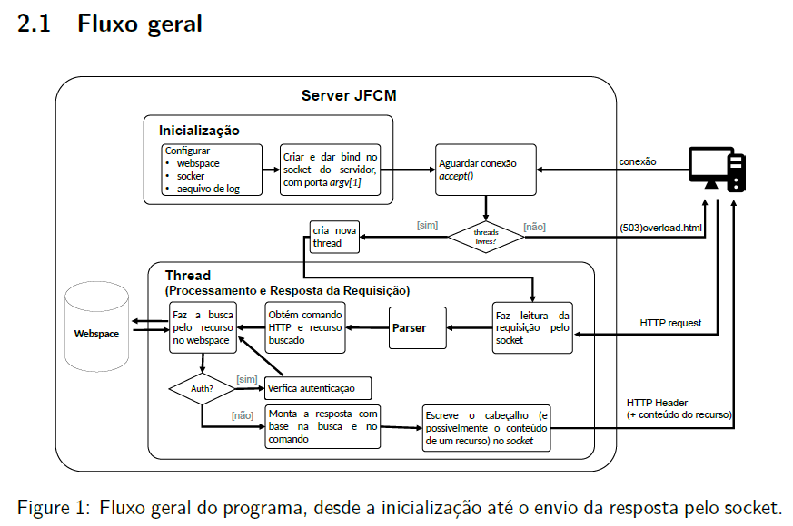

# C WebServer

## Descrição do sistema

O servidor web desenvolvido, em linguagem C, tem por objetivo demonstrar e motivar a aplicação de conceitos de software básico. Sendo assim, o sistema em sua forma final foi responsável por exercitar conceitos nas áreas de

- **compiladores**, com a construção de um parser para interpretação de requisições
- **sistemas operacionais**, com processos, threads, syscalls
- **redes**, com sockets, protocolo HTTP, protocolo TCP e documentos RFC

Na sua atual forma, o sistema é capaz de atender requisições do tipos GET, HEAD, TRACE, OPTIONS e POST (particularmente, nos formulários de troca de senha). Isso indica que o servidor consegue até mesmo interagir com o browser, onde serão realizados os testes.

As capacidades efetivas do servidor consistem em: atender múltiplas requisições com threads, manusear um webspace com arquivos protegidos por `.htaccess`, arquivos sem permissão apropriada (de leitura e varredura), responder requisições com diversos tipos de recursos, como HTML, imagens (jpg, png e gif), pdf, texto. Além disso, o servidor implementa uma forma rudimentar de autenticação fazendo uso de arquivos `.htpasswd` com senhas criptografadas.

Trata-se, portanto, de um servidor simplificado que não apresenta uma interação com banco de dados, não implementa técnicas robustas de segurança e não busca atingir o maior grau de otimização.

O fluxo de informações do programa pode ser resumido na figura abaixo



Para realizar os testes, será preciso compilar o programa e construir o parser, com ajuda do script `scripts/compile_server.sh`, e ajustar as permissões dos webspaces, a partir dos scripts `configurar_permissoes.sh`.

```bash
# Compila o servidor e gera o executável "server" na raiz do projeto
./scripts/compile_server.sh 

# Configura a permissão do webspace desejado
cd web/meu-webspace/
./configura_permissoes.sh
cd ../../

# Executa o programa com
# ./server <portNum> <webspace> <logfile> <threads>
./server 8080 meu-webspace log.txt 4

# Testes podem ser realizados acessando http://localhost:8080/
```

A maioria dos testes levou em conta as seguintes versões dos softwares gcc (9.4.0), bison (3.5.1) e flex (2.6.4).